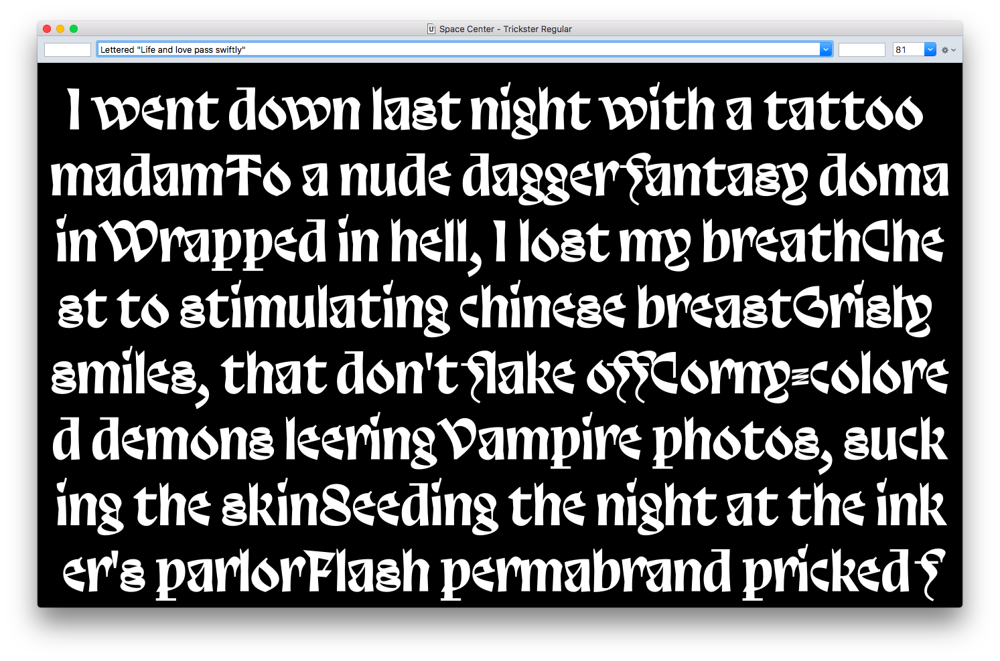
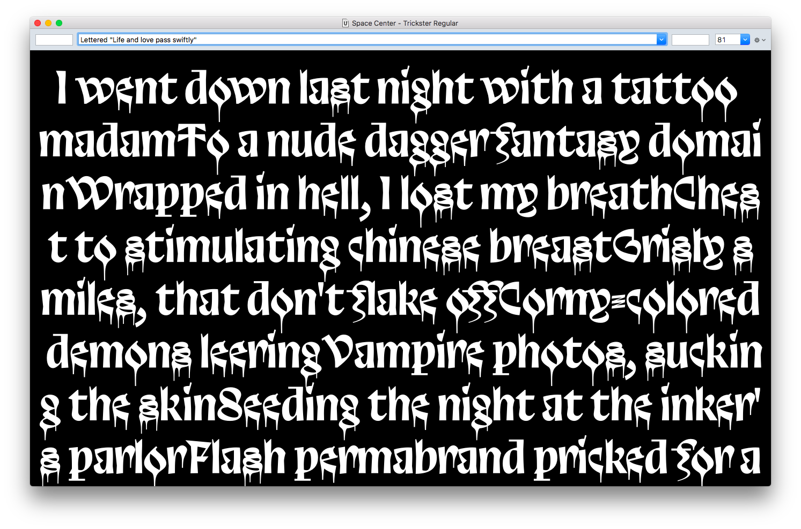

# Trickster

is a typeface by [Jean-Baptiste Morizot](http://jbmorizot.fr/)



## Présentation

```
Trickster is a typeface mixing a lot of oddities smoothly.

Sans-serif, but with calligraphic influence and strong contrast, 
Trickster borrows shapes from Merovingian writing, Blackletters construction 
and contemporean drawing. Trickster is a display typeface in one bold weight. 
Its unusual shapes, tight spacing and various alternates allow designers 
to create quickly strong headlines and beautiful titling.
```

## Features

```
A lot of (named!) stylistic set allows to create powerful word shapes.

Stylistic Set 01 : 'Boring forms'
Stylistic Set 02 : 'Burger s, smoky f'
Stylistic Set 03 : 'Dripping Blood'
Stylistic Set 04 : 'Closed a'
Stylistic Set 05 : 'Alt Ampersand'
Stylistic Set 06 : 'Horny e'
Swash forms
Old Style Figures
```



## Licence

SIL Open Font License v1.1

## Process

More on the design process [here](https://medium.com/@jbmorizot/trikster-a-postmortem-686f4608da9e)